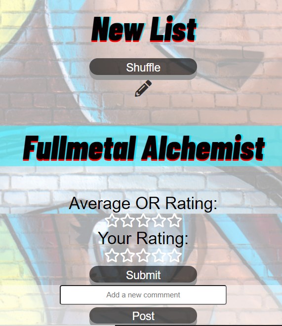

OtakuRisuto

Live link: https://otaku-risuto.vercel.app/
Demo Username:
Demo Password:
INTRODUCTION: Why OtakuRisuto

Welcome to OtakuRisuto, your home to manage, track, and make progress on all the anime you have put on the backburner

All anime enthusiasts know there are more anime (good or bad) than one person could watch in a lifetime. Because of the enormous amount of content, we developed OtakuRisuto to allow our users to search for any anime in the world and add it to customizable lists. This means our users will be able to organize all the anime they want to watch in meaningful ways to make the process of what to watch next easier.

If our users still can't decide what to watch next, we have them covered. We implemented a shuffle feature that will calculate and select for the user an anime to watch next based on specific user preferences.

We understand that there are increasing amount of people discovering anime for the first time as well. Because of that, a user can search for and clone anime lists created by other users that they have made public. The lists also have a rating system and comment section to help our community discover new content that fit their taste.

APP: Registration and Login

Anyone is allowed to register for an account as long as they provide an email address, a username, and password.

All fields are required and the password must meet specific requirements. Once the client receives a valid response, the user will automatically be redirected to the login page where they will then enter their login information.

If the user is registering for the first time, they will automatically be logged-in and redirected to their dashboard page.
Otherwise, returning users can login through the login page.

APP: Suggestions

After a successful registration, the user will be taken to their dashboard page where they will prompted to create their first anime list. We will provide the user with ten suggestions from some of the most popular anime to make getting started easy.

APP: Dashboard

The dashboard is where our users will be able to access the majority of our application's features. On the left is a navigation menu where a user can quickly access any list they have added as well as add a new empty list. The menu can be toggled by a button at the top.

At the top of the dashboard is a search bar where the user can search by name for specific anime, other users, or other users' lists.

The center of the dashboard will be populated with all the data from a list they selected from the navigation menu.

APP: User List

When a user selects a list from the navigation menu, all the anime from that list will be populated in the center of their dashboard. Each anime listed is expandable with a single click and will provide the user with specific information about that anime such as description, genre, rating, episode count, etc. as well as a trash icon to remove that specific anime from the list.

The user will also have the option to leave a rating and comments for that list. Additionally by clicking the edit icon for the list, the user can edit the list name or delete the entire list.

The shuffle button will automatically calculate and present the user with an anime to watch next based on their specific preferences.

APP: Search

The user has three categories to search: anime, users, and lists.

When a user searches for an anime, they will be presented with the ten closest results. By hovering over an anime or clicking the expand button, a user will get specific information about that anime and have the option to add it to a specific list.

A user can also search for specific user by their username and see all the lists that they have made publicly available. Any user can comment on, rate, or clone lists that are public.

A user can also search for specific lists by list name.

TECHNOLOGY:

Back-End Node, Express, Javascript, Knex, Postgres, Nodemon, Bcrypt, JSON Web Token

Testing - Mocha, Chai

Production - Deployed via Heroku

GETTING STARTED:

Run npm install to load dependencies

Create Database and Test Database

Move example.env to .env, and fill in your own values

Run npm run migrate

Run npm run migrate:test

Run npm test to ensure a stable build

This is only the backend server, so to develop locally you'll need the front end client as well

To get the front end up and running see https://github.com/Cap3-Nate-Chad-Brandon-Michael-Josh/OtakuRisuto

Deployments are handled through Heroku and can be run via npm run deploy
