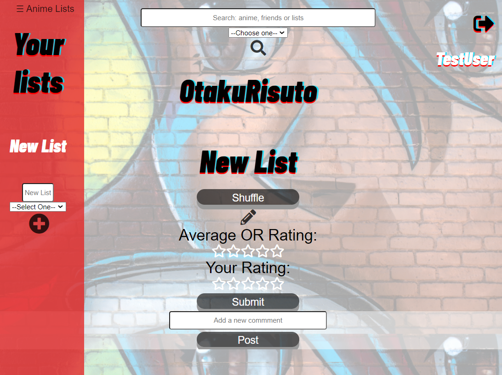

# OtakuRisuto

Live link: https://otaku-risuto.vercel.app/
Demo Username: DemoUser
Demo Password: P@ssword1

## INTRODUCTION: Why OtakuRisuto

Welcome to OtakuRisuto, your home to manage, track, and make progress on all the anime you have put on the backburner

All anime enthusiasts know there are more anime (good or bad) than one person could watch in a lifetime. Because of the enormous amount of content, we developed OtakuRisuto to allow our users to search for any anime in the world and add it to customizable lists. This means our users will be able to organize all the anime they want to watch in meaningful ways to make the process of what to watch next easier.

If our users still can't decide what to watch next, we have them covered. We implemented a shuffle feature that will calculate and select for the user an anime to watch next based on specific user preferences.

We understand that there are increasing amount of people discovering anime for the first time as well. Because of that, a user can search for and clone anime lists created by other users that they have made public. The lists also have a rating system and comment section to help our community discover new content that fit their taste.

### APP: Registration and Login

Anyone is allowed to register for an account as long as they provide an email address, a username, and password.

All fields are required and the password must meet specific requirements. Once the client receives a valid response, the user will automatically be redirected to the login page where they will then enter their login information.

If the user is registering for the first time, they will automatically be logged-in and redirected to their dashboard page.
Otherwise, returning users can login through the login page.

### APP: Suggestions

After a successful registration, the user will be taken to their dashboard page where they will prompted to create their first anime list. We will provide the user with ten suggestions from some of the most popular anime to make getting started easy.

### APP: Dashboard

The dashboard is where our users will be able to access the majority of our application's features. On the left is a navigation menu where a user can quickly access any list they have added as well as add a new empty list. The menu can be toggled by a button at the top.

At the top of the dashboard is a search bar where the user can search by name for specific anime, other users, or other users' lists.

The center of the dashboard will be populated with all the data from a list they selected from the navigation menu.

### APP: User List

When a user selects a list from the navigation menu, all the anime from that list will be populated in the center of their dashboard. Each anime listed is expandable with a single click and will provide the user with specific information about that anime such as description, genre, rating, episode count, etc. as well as a trash icon to remove that specific anime from the list.

The user will also have the option to leave a rating and comments for that list. Additionally by clicking the edit icon for the list, the user can edit the list name or delete the entire list.

The shuffle button will automatically calculate and present the user with an anime to watch next based on their specific preferences.

### APP: Search

The user has three categories to search: anime, users, and lists.

When a user searches for an anime, they will be presented with the ten closest results. By hovering over an anime or clicking the expand button, a user will get specific information about that anime and have the option to add it to a specific list.

A user can also search for specific user by their username and see all the lists that they have made publicly available. Any user can comment on, rate, or clone lists that are public.

A user can also search for specific lists by list name.

## API

### -POST 
Expects an anime object containing the title, description, rating, episode count, and an array of genres, and the list_id of the list it goes on. First, we verify that the correct data was sent, and that the user sending it has authority to alter the list they want to add the anime to. If the anime is not currently in the database, it is added to the database. if it is in the database, it is updated with the latest information. Then, the server creates a list_anime entry into the database that connects the anime to the users list with the use of a through table. Endpoint returns the original anime object to the client and a status of 201 on success.
### -DELETE 
Expects a list_anime_id which should be a number. We verify that the user sending the request has authoirty to alter the list they want to delete the anime from, and if so we delete the entry in the list_anime through table connecting it to their list. This does not delete our information on the anime itself, simply removes it from their list. Returns a 204 status.
/auth/login
### -POST 
Expects a username and a password. Looks in database to determine if the credentials are valid, and if so, returns a 200, and an authToken which is a JWT.
/auth/register
### -POST 
Expects a username, password, and email. If the username is available, returns a 201, and a user object containing a serialized version of the username, and the user_id.
/list
### -GET 
Returns all lists belonging to a user as an array. Each list is an object containing the values for name, rating, user_rating, and private, which are a string, a number, a number, and a boolean.
### -POST 
Expects a name string, and a private boolean. Optionally, can take an array of anime objects containing the title, description, rating, episode count, and an array of genres. Adds any anime not in the database to the database, and updates any that are in the database with latest information. Creates an entry for each anime in the list_anime through table to connect them to the list. Returns 201 and a string "List successfulyl added" upon success.
/list/:id
### -GET 
Returns a list object containing the name string, private boolean, owner_username string, rating integer, user_rating integer, an array of comment objcts containing the comment string and username string, an array of list_anime objects containing the list_id integer and anime_id integer, and and an anime array, each being an object containing the title, description, rating, episode count, and an array of genres.
### -PATCH 
Expects a name string and private boolean, verifies the user has authority to alter the list, and if so updates the database entry for the list with the new name and private. Returns 200 and an item object containing the name string, private boolean, owner_username string, rating integer, user_rating integer, an array of comment objcts containing the comment string and username string, an array of list_anime objects containing the list_id integer and anime_id integer, and and an anime array, each being an object containing the title, description, rating, episode count, and an array of genres.
### -DELETE 
Expects a list_id integer, verifies the user has authority to alter the list, and if so, deletes the list from the database, returns 204.
/list/comment
### -POST 
Expects a comment string and a list_id integer. Adds a new comment to the databse corresponding to the list_id, and returns 201, and a copy of the comment added to database.
/list/rating
### -POST 
Expects rating integer, and list_id integer. Checks if user has already rated list at list_id. If not, adds a new rating to rating table for their rating of list, if so, updates previous rating. Returns an object containing rating_user_id integer, rating integer, and list_id integer.
/list/user/:user_id
### -GET 
Returns 200 and all lists belonging to a user where private value is false as an array. Each list is an object containing the values for name, rating, user_rating, and private, which are a string, a number, a number, and a boolean.
/search/users/:term
### -GET 
Returns 200 and an array of all users whose username contains the search term.
/search/lists/:term
### -GET 
Returns 200 and an array of all lists whose name contains the search term.

## TECHNOLOGY:

Back-End Node, Express, Javascript, Knex, Postgres, Nodemon, Bcrypt, JSON Web Token

Testing - Mocha, Chai

Production - Deployed via Heroku

### GETTING STARTED:

Run npm install to load dependencies

Create Database and Test Database

Move example.env to .env, and fill in your own values

Run npm run migrate

Run npm run migrate:test

Run seed file

Run npm test to ensure a stable build

This is only the backend server, so to develop locally you'll need the front end client as well

To get the front end up and running see https://github.com/Cap3-Nate-Chad-Brandon-Michael-Josh/OtakuRisuto

Deployments are handled through Heroku and can be run via npm run deploy
